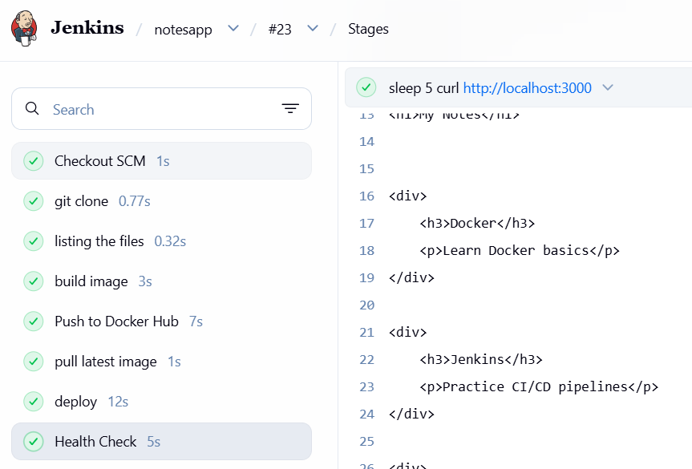
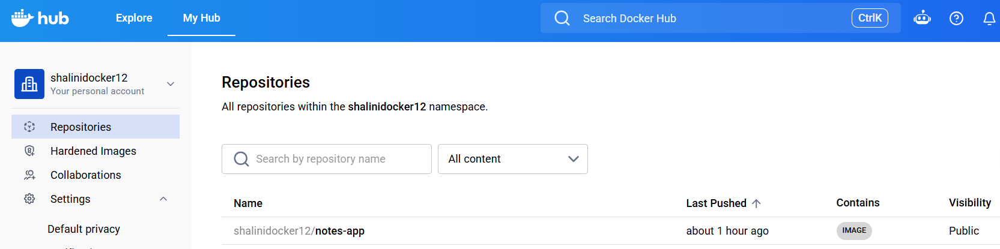
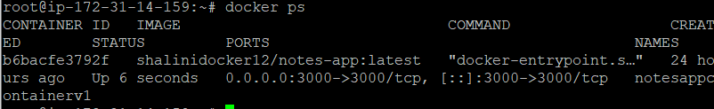
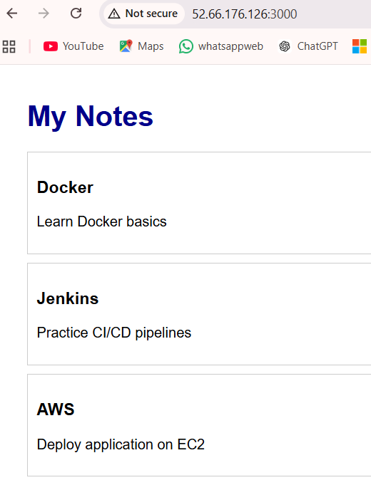

# Notes App CI/CD Pipeline Project

## Project Overview

This project demonstrates an end-to-end CI/CD pipeline for a Node.js Notes Application using GitHub, Jenkins, Docker, Docker Hub, and AWS EC2.

The pipeline automatically builds, pushes, pulls, deploys, and validates the application whenever code changes are pushed to GitHub.

---

## Technologies Used
``` text
- Linux (Ubuntu EC2)
- Git & GitHub
- Jenkins
- Docker
- Docker Hub
- AWS EC2
- Node.js
- Express.js
```

---

## Project Architecture
``` text
Developer
↓
GitHub Repository
↓
GitHub Webhook
↓
Jenkins Pipeline
↓
Build Docker Image
↓
Push to Docker Hub
↓
Pull Latest Image
↓
Deploy Container
↓
Health Check
↓
Application Available
```
---

## Project Structure
``` text
notes_app/
├── Dockerfile
├── Jenkinsfile
├── package.json
├── server.js
├── data/
│   └── notes.json
├── public/
└── views/
```
---

## CI/CD Pipeline Stages

### 1. Checkout Code

Jenkins automatically checks out the latest source code from GitHub.

### 2. Build Docker Image

Builds the Docker image using the Dockerfile.

### 3. Push Image to Docker Hub

Authenticates with Docker Hub and pushes the latest image.

### 4. Pull Latest Image

Pulls the latest image from Docker Hub.

### 5. Deploy Application

Stops the existing container and deploys a new container.

### 6. Health Check

Verifies that the application is responding successfully on port 3000.

---

## Jenkins Pipeline

```groovy

pipeline {
    agent any
    stages {
        stage("git clone"){
            steps{
                git branch: 'main',
                credentialsId: 'github-creds',
                url: 'https://github.com/shaliniche-code/notes_app.git'
            }
        }
        stage("listing the files"){
            steps{
                sh 'ls'
            }
        }
        stage("build image"){
    steps{
        sh 'docker rm -f notesapplatest || true'
        sh 'docker build -t notesapplatest .'
    }
}

        stage('Push to Docker Hub') {
    steps {
        withCredentials([
            usernamePassword(
                credentialsId: 'dockerhub-creds',
                usernameVariable: 'DOCKER_USER',
                passwordVariable: 'DOCKER_PASS'
            )
        ]) {
            sh '''
            echo $DOCKER_PASS | docker login -u $DOCKER_USER --password-stdin

            docker tag notesapplatest $DOCKER_USER/notes-app:latest

            docker push $DOCKER_USER/notes-app:latest
            '''
        }
    }
}
         stage("pull latest image"){
            steps{
                  sh 'docker pull shalinidocker12/notes-app:latest'
                }
}

        stage("deploy"){
            steps{
                sh '''
                docker container prune -f
                docker stop notesappcontainerv1 || true
                docker rm notesappcontainerv1 || true
                docker run -d --name notesappcontainerv1 -p 3000:3000 shalinidocker12/notes-app:latest
                '''
            }
        }

        stage('Health Check') {
    steps {
        sh '''
        sleep 5
        curl http://localhost:3000
        '''
    }
}
    }

 }


## Jenkins Pipeline



## Docker Hub



## Running Container




## Application



