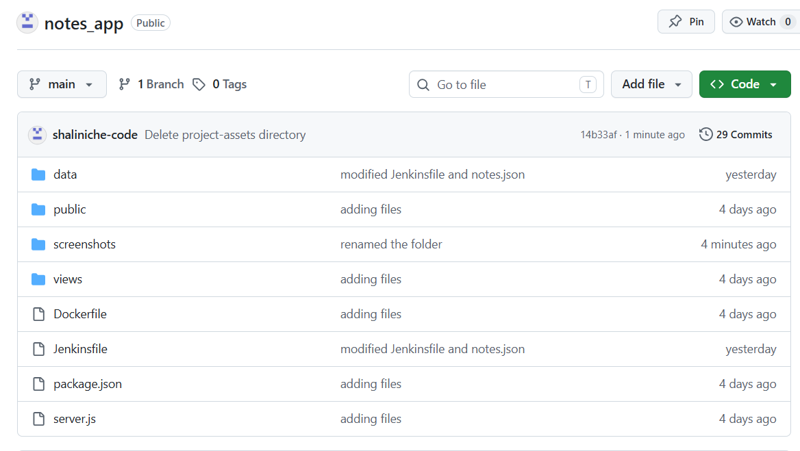

# Notes App CI/CD Pipeline Project

## Project Overview

This project demonstrates an end-to-end CI/CD pipeline for a Node.js Notes Application using GitHub, Jenkins, Docker, Docker Hub, and AWS EC2.

The pipeline automatically builds, pushes, pulls, deploys, and validates the application whenever code changes are pushed to GitHub.

---

## Technologies Used
``` text
- Linux (Ubuntu EC2)
- Git & GitHub
- Jenkins
- Docker
- Docker Hub
- AWS EC2
- Node.js
- Express.js
```

---

## Project Architecture
``` text
Developer
↓
GitHub Repository
↓
GitHub Webhook
↓
Jenkins Pipeline
↓
Build Docker Image
↓
Push to Docker Hub
↓
Pull Latest Image
↓
Deploy Container
↓
Health Check
↓
Application Available
```
---

## Project Structure
``` text
notes_app/
├── Dockerfile
├── Jenkinsfile
├── package.json
├── server.js
├── data/
│   └── notes.json
├── public/
└── views/
```
---

## CI/CD Pipeline Stages

### 1. Checkout Code

Jenkins automatically checks out the latest source code from GitHub.

### 2. Build Docker Image

Builds the Docker image using the Dockerfile.

### 3. Push Image to Docker Hub

Authenticates with Docker Hub and pushes the latest image.

### 4. Pull Latest Image

Pulls the latest image from Docker Hub.

### 5. Deploy Application

Stops the existing container and deploys a new container.

### 6. Health Check

Verifies that the application is responding successfully on port 3000.

---


## Jenkins Pipeline

The complete Jenkins pipeline is available in the `Jenkinsfile` located in the root directory of this repository.

## Github



## Jenkins Pipeline


## Docker Hub


## Running Container


## Application


## Challenges Faced

- Container exiting immediately due to missing `notes.json`
- Docker container name conflicts
- README image rendering issue
- Rebuilding image after code changes
- Understanding Docker layer caching

## Key Learnings

- Writing Dockerfiles for Node.js applications
- Docker layer caching optimization
- GitHub Webhook integration
- Jenkins Pipeline creation
- Docker Hub authentication using credentials
- Automated deployment on AWS EC2
- Health Check implementation using `curl`
- Container lifecycle management

## Future Enhancements

- Add automated testing stage
- Add SonarQube code quality checks
- Deploy using Docker Compose
- Deploy to Kubernetes
- Implement Blue-Green deployment
- Add Slack/Email notifications

## Author

**Shalini**

DevOps Learner | Linux | Docker | Jenkins | AWS
